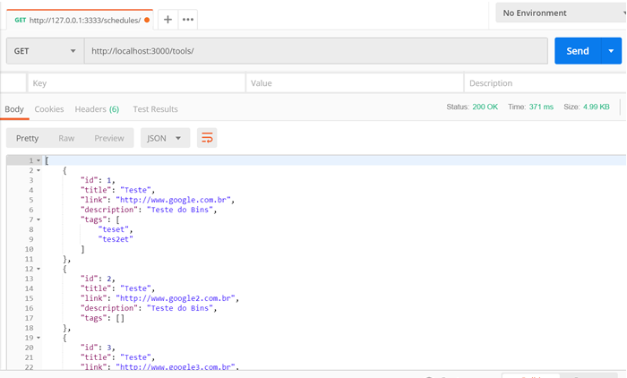

# Desafio Backend - BossaBox

Neste desafio, foi feita uma API NodeJS para consumir um banco de dados MySQL.

O desafio de Frontend, que consiste em consumir a mesma API, também foi feito, ele pode ser visto neste link:

https://github.com/dbins/bossabox_frontend

## Instalação

- git clone https://github.com/dbins/bossabox_backend
- No servidor de banco de dados MySQL, crie um banco de dados vazio chamado bossabox (CREATE DATABASE bossabox)
- Edite o arquivo src/config/database.js e informe o endereço do servidor MySQL e porta
- npm install
- npm start

## Rotas da API

A documentação da API pode ser consultada na página [api.html](api.html) localizada na raiz do projeto. Abaixo segue um resumo das rotas disponíveis:

| Rota       | Método | Descrição                    |
| ---------- | ------ | ---------------------------- |
| /login     | POST   | Faz o login de um usuário    |
| /usuario   | POST   | Cria um novo usuário         |
| /tools     | GET    | Listar tools                 |
| /tools     | POST   | Criar uma nova tool          |
| /tools/:id | GET    | Detalhes da tool selecionada |
| /tools/:id | PUT    | Atualiza uma tool            |
| /tools/:id | DELETE | Apaga uma tool               |

As rotas [POST]/tools/,  [PUT]/tools/:id e [DELETE]/tools/:id exigem a autenticação do usuário e o envio de um token JWT de autorização no cabeçalho da requisição

A documentação do projeto foi feita utilizando a Blueprint API (api.md), mas também existe uma documentação feita com Swagger. Na pasta DER se encontra o Diagrama de Entidades e Relacionamento do banco de dados em vários formatos.

## Testes

No terminal, a partir da raiz do projeto, digite npm run test para executar os testes da aplicação. Os testes foram feitos utilizado o Jest + Supertest

Além dos testes feitos com o Jest, também foram feitos testes utilizando a biblioteca Dredd.

## DOCKER

Na raiz do projeto existe um arquivo Dockerfile com a configuração para criar um container para a aplicação e um arquivo docker-compose.yml para subir este container junto com outro container criado para subir a API de exemplo utilizada pela aplicação.

Os testes foram feitos no Windows 10. O passo a passo para subir o container é o seguinte:

- Abrir o programa "Kitematic (Alpha)"
- Dentro dele, na parte inferior esquerda, clicar em "Docker CLI". Será aberta uma janela de terminal do PowerShell.
- Navegar até a pasta onde o projeto foi copiado
- Verifique qual o IP usado pelo docker usando o comando docker-machine ip default
- Editar o arquivo docker-compose.yml.  Na seção "environment" dos dois serviços, validar as credenciais do banco de dados.
- Subir os containers utilizando o comando docker-compose up
- Para acessar a aplicação, no navegador, digitar http://<IP_DO_DOCKER>:3000

### Comandos úteis do Docker

-  docker ps - Para conferir os containers que estão em execução
-  docker-compose up --build - Para atualizar um container depois de editar o arquivo dockerfile ou docker-compose.yml
-  docker-machine start default - Para iniciar o serviço do docker, caso a inicialização será manual
-  docker-compose logs - Exibe os logs dos containers em execução
-  docker images - Lista as imagens cadastradas na máquina host
-  docker run <<nome do container>> - Inicia um container
-  docker stop <<nome do container>> - Encerra a execução de um container
-  docker stop $(docker ps -a -q)  - Encerra a execução de todos os container
-  docker rmi $(docker images -f “dangling=true” -q) - Exclui todos os container temporários (que possuem <None> no nome)
-  docker build - Cria um container a partir de um arquivo Dockerfile localizado na pasta onde o comando foi executado. Para iniciar vários containers ao mesmo tempo, utilize uma arquivo docker-compose.yml
-  docker volumes ls - Lista os volumes, que são as pastas compartilhadas usadas para persistir dados dos containers.
-  docker rm <<nome do container>> - Apaga um container
-  docker kill <<nome do container>> - Derruba o container informado
-  docker run -i -t <<nome do container>> /bin/bash - Acessa o terminal do container-
-  docker-compose up - Executar os containers informados no arquivo docker-compose.yml
-  docker-compose down - Encerra a execução dos containers iniciados pelo arquivo docker-compose.yml
 

